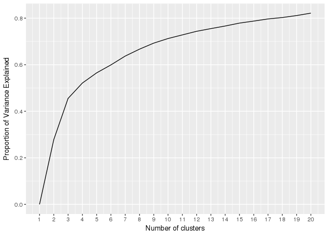

## Cleaning Data

First, we read in the data and clean date-times and classify datatypes. Before, I mapped Unicode hex codes to emojis and symbols, but now realize that having these values isn't very useful. Therefore, we remove all unrecognized symbols.

Previously, I was replacing hex codes with their corresponding emojis. Credit to Kate Lyons and Jessica Peterka-Bonetta for developing a free dictionary for translating Unicode to emojis. Unfortunately, the literature on using emojis in sentiment analyses is sparse and unexplored. Emojis were generally used frequently (about 1/8 of tweets had some kind of emoji or symbol), but no single emoji was used with extreme frequency. Further analysis would involve coding obvious emojis to their corresponding sentiments (e.g. laughter, love, or heart emojis coded to positive sentiments).


```
## Input contains no \n. Taking this to be a filename to open
## File opened, filesize is 0.236283 GB.
## Memory mapping ... ok
## Detected eol as \n only (no \r afterwards), the UNIX and Mac standard.
## Positioned on line 3 after skip or autostart
## This line isn't blank and skip>0 so we're done
## Detecting sep ... ','
## Detected 19 columns. Longest stretch was from line 3 to line 32
## Starting data input on line 3 (either column names or first row of data). First 10 characters: "2",1,NA,"
## The line before starting line 3 is non-empty and will be ignored (it has too few or too many items to be column names or data): "1",NA,"V1","V2","V3","V4","V5","V6","V7","V8","V9","V10","V11","V12","V13","V14","V15","V16","V17"'header' changed by user from 'auto' to TRUE
## nrow set to nrows passed in (753804)
## Type codes (point  0): 4144444444444444400
## Type codes (point  1): 4144444444444444400
## Type codes (point  2): 4144444444444444400
## Type codes (point  3): 4144444444444444400
## Type codes (point  4): 4144444444444444400
## Type codes (point  5): 4144444444444444400
## Type codes (point  6): 4144444444444444400
## Type codes (point  7): 4144444444444444400
## Type codes (point  8): 4144444444444444400
## Type codes (point  9): 4144444444444444400
## Type codes (point 10): 4144444444444444400
## Column 18 ('longitude') was detected as type 'logical' but bumped to 'character' as requested by colClasses
## Column 19 ('latitude') was detected as type 'logical' but bumped to 'character' as requested by colClasses
## Type codes: 4144444444444444444 (after applying colClasses and integer64)
## Type codes: 4144444444444444444 (after applying drop or select (if supplied)
## Allocating 19 column slots (19 - 0 dropped)
## 
Read 6.6% of 753804 rows
Read 21.2% of 753804 rows
Read 38.5% of 753804 rows
Read 59.7% of 753804 rows
Read 90.2% of 753804 rows
Read 92.9% of 753804 rows
Read 753804 rows and 19 (of 19) columns from 0.236 GB file in 00:00:12
## Read 753804 rows. Exactly what was estimated and allocated up front
##    0.110s (  1%) Memory map (rerun may be quicker)
##    0.000s (  0%) sep and header detection
##    0.000s (  0%) Count rows (wc -l)
##    0.000s (  0%) Column type detection (100 rows at 10 points)
##    1.710s ( 15%) Allocation of 753804x19 result (xMB) in RAM
##    9.710s ( 84%) Reading data
##    0.000s (  0%) Allocation for type bumps (if any), including gc time if triggered
##    0.000s (  0%) Coercing data already read in type bumps (if any)
##    0.030s (  0%) Changing na.strings to NA
##   11.560s        Total
```

## Exploratory Analysis

Next, we want to familiarize ourselves with how our data look.

We see that we have about 750k observations (individual tweets), and 28 variables.

Looking at  individual columns, there are a few interesting variables. The richest variable is `text`, which contains the actual text of the tweets. Then we have the Twitter handle that authored the tweet, the account the tweet is replying to, metrics like favorites and retweets, and administrative variables like time and location of the tweet's origination. All other variables are either superfluous or not useful.


```
## Observations: 753,804
## Variables: 29
## $ idx1          <dbl> 3, 4, 5, 6, 7, 8, 9, 10, 11, 12, 13, 14, 15, 16,...
## $ idx2          <int> 2, 3, 4, 5, 6, 7, 8, 9, 10, 11, 12, 13, 14, 15, ...
## $ idx3          <dbl> 1, 2, 3, 4, 5, 6, 7, 8, 9, 10, 11, 12, 13, 14, 1...
## $ text          <chr> "@KristySwansonXO Like this one? https://t.co/Ll...
## $ favorited     <lgl> FALSE, FALSE, FALSE, FALSE, FALSE, FALSE, FALSE,...
## $ favoriteCount <dbl> 0, 0, 0, 0, 0, 0, 0, 0, 0, 0, 0, 0, 0, 0, 0, 0, ...
## $ replyToSN     <chr> "KristySwansonXO", "LapoBK", "Lauramchapman", "S...
## $ created       <dttm> 2017-02-23 22:27:55, 2017-02-23 22:22:32, 2017-...
## $ truncated     <lgl> FALSE, FALSE, FALSE, FALSE, FALSE, FALSE, FALSE,...
## $ replyToSID    <chr> "834866636360392704", "834871431162888192", "834...
## $ id            <chr> "834892573365972995", "834891215866851328", "834...
## $ replyToUID    <chr> "45033456", "2373874716", "34731404", "228760178...
## $ statusSource  <chr> "<a href=\"\"http://twitter.com\"\" rel=\"\"nofo...
## $ screenName    <chr> "WholeFoods", "WholeFoods", "WholeFoods", "Whole...
## $ retweetCount  <dbl> 0, 0, 0, 0, 0, 0, 0, 0, 0, 0, 0, 0, 0, 0, 0, 0, ...
## $ isRetweet     <lgl> FALSE, FALSE, FALSE, FALSE, FALSE, FALSE, FALSE,...
## $ retweeted     <lgl> FALSE, FALSE, FALSE, FALSE, FALSE, FALSE, FALSE,...
## $ longitude     <dbl> NA, NA, NA, NA, NA, NA, NA, NA, NA, NA, NA, NA, ...
## $ latitude      <dbl> NA, NA, NA, NA, NA, NA, NA, NA, NA, NA, NA, NA, ...
## $ isReply       <lgl> TRUE, TRUE, TRUE, TRUE, TRUE, TRUE, TRUE, TRUE, ...
## $ date          <date> 2017-02-23, 2017-02-23, 2017-02-23, 2017-02-23,...
## $ time          <chr> "22:27:55", "22:22:32", "22:21:44", "21:54:11", ...
## $ year          <dbl> 2017, 2017, 2017, 2017, 2017, 2017, 2017, 2017, ...
## $ month         <dbl> 2, 2, 2, 2, 2, 2, 2, 2, 2, 2, 2, 2, 2, 2, 2, 2, ...
## $ day           <dbl> 23, 23, 23, 23, 23, 23, 23, 23, 23, 23, 23, 23, ...
## $ hour          <dbl> 22, 22, 22, 21, 21, 21, 21, 21, 21, 21, 21, 21, ...
## $ minute        <dbl> 27, 22, 21, 54, 43, 43, 43, 43, 43, 40, 39, 38, ...
## $ second        <dbl> 55, 32, 44, 11, 42, 3, 3, 3, 2, 3, 3, 41, 3, 31,...
## $ website       <chr> "Twitter Web Client", "Spredfast", "Spredfast", ...
```

The following is a tabulation of the number of unique variables each variables takes. We see that there are 115 unique companies. Additionally, all the date and time variables are correctly coded. It's unclear what `idx2` and `idx3` are supposed to represent. The boolean variables `favorited` and `retweeted` are incorrectly coded. Assumedly, we only have non-retweets in our sample because there is a single unique value for `isRetweet`.


```
##     idx1   idx2 idx3   text favorited favoriteCount replyToSN created
## 1 753804 196284 3200 709979         1          5565    413242  711658
##   truncated replyToSID     id replyToUID statusSource screenName
## 1         2     559879 753804     413585          108        115
##   retweetCount isRetweet retweeted longitude latitude isReply date  time
## 1         3144         1         1        24       24       2 1898 82239
##   year month day hour minute second website
## 1    8    12  31   24     60     60     108
```

We also want to see the shape of the distributions of our continuous variables. Both favorites and retweets are extremely right skewed, which is to be expected. After log transforming both variables along with log transforming y-axes, there is a quasi-linear relationship as each variables increases and observed frequencies. We split tweets by whether they are a reply or not, because replies are not visible on Twitter feeds to followers.

<!-- --><!-- -->

Looking at the frequency of tweets over time, there seems to be an interesting spike in tweet frequency at the beginning of 2017. There isn't a clear explanation for this observation, especially since there aren't any spikes as similar times during other years. Otherwise, the distribution is expectedly left-skewed as companies increase social media interactions over time.

The second graph shows a distribution of tweet frequencies over time by individual companies. There are stark differences in behavior. Some companies maintain high frequency of tweets, while other keep low frequencies of tweets. Other companies gradually increase tweeting, while another group tweets less predictably and tweets with high frequency every so often.

<!-- --><!-- -->

As for locational data, most companies don't disclose their location when tweeting. We only find 26 observations that have a location, which makes the data useless.


screenName    locationTweets
-----------  ---------------
corona                     2
gucci                     23
Lexus                      1

Our dataset also provides the platform source of the screenName's tweet. David Robinson did a [very interesting text analysis](http://varianceexplained.org/r/trump-tweets/) demonstrating why a tweet's source can be informative. There are a large variety of platforms used, but a large proportion use third-party platforms like Sprinklr, Lithium, Radian6, or Spredfast to manage general customer experience across social media sites.


website                             source
---------------------------------  -------
Sprinklr                            159039
Twitter Web Client                   83157
Lithium Tech.                        76180
Spredfast app                        64310
Radian6 -Social Media Management     44266
Spredfast                            32990
Lithium Tech                         30417
TweetDeck                            29119
Sparkcentral.com                     28896
LiveWorld Inc                        20212
Sprinklr Prod2                       20063
Conversocial                         19726
Hootsuite                            15100
Oracle Engage                        12493
Twitter for iPhone                   11177
BIG Connect 2                         9729
Percolate                             9664
Wilke Global SMART                    8365
Media Studio                          7982
Insightpool                           5538

We find each company's most frequently used method of tweeting. As a note, it might be interesting to look for differences in Twitter usage based on what platform the company uses to write tweets.


website                            screenName         source   sourcePercent
---------------------------------  ----------------  -------  --------------
Radian6 -Social Media Management   Accenture            1183       0.7691808
Twitter Web Client                 adidasoriginals      3007       0.4681613
Spredfast app                      AEO                  4175       0.7999617
Twitter Web Client                 Allianz               599       0.5972084
Sprinklr                           amazon               3910       0.9453578
Sprinklr                           AmericanExpress      7633       0.7833539
Conversocial                       Android              5067       0.8533176
Sprinklr                           ATT                  9551       0.6404050
Sprinklr                           Audi                 2743       0.9229475
Twitter Web Client                 BankofAmerica         310       0.5709024
Facelift Cloud                     BASF                  551       0.5375610
Sprout Social                      bbva                 1743       0.4641811
Spredfast app                      BestBuy              8746       0.9366031
Radian6 -Social Media Management   BlackBerry           1180       0.9941028
Sprinklr                           BMW                  5312       0.9977461
Twitter Web Client                 Boeing                249       0.4715909
Earshot App                        Budweiser            4417       0.5693478
Spredfast app                      Burberry             3836       0.6085025
Shoutlet API                       CanonUSA             1645       0.6165667
Twitter Web Client                 Cartier               916       0.4044150
Spredfast                          CaterpillarInc       3621       0.8490035
Twitter Web Client                 CHANEL               2583       0.8803681
Sprinklr                           Chase                 847       0.4964830
Spredfast app                      chevrolet            1698       0.3714723
Sprinklr                           Cisco                1848       0.7914347
Sprinklr                           Citi                 1061       0.9584463
Spredfast app                      Coach                 205       0.4027505
Sprinklr                           CocaCola            16464       0.9867546
Social Relationship Management     Colgate              3217       0.8150494
Percolate                          corona                441       0.4900000
Spredfast app                      Costco               1425       1.0000000
Twitter Web Client                 Danone                315       0.5000000
Sparkcentral.com                   Delta               28868       0.8178830
Fan Experiences Platform           Disney               3121       0.6036750
SentimentMetrics.com               eBay                 3166       0.6192059
Spredfast app                      espn                 1664       0.9353569
Hootsuite                          Etsy                 1236       0.2831615
Spredfast app                      facebook             7303       0.9967244
LiveWorld Inc                      FedEx                1234       0.3740527
Buffer                             Fendi                1354       0.4049043
Twitter Web Client                 Ford                10235       0.7030016
Twitter Web Client                 FoxNews              8051       0.5756471
Wilke Global SMART                 Fritolay             7335       0.9602042
Radian6 -Social Media Management   Gap                  6954       0.8924538
Twitter Web Client                 generalelectric      2085       0.6523780
Sprinklr                           Gillette             8411       0.9376812
Conversocial                       Google              14654       0.8819741
Hootsuite                          gucci                2674       0.4045386
Twitter Web Client                 Heineken             3740       0.9216363
Twitter Web Client                 Hermes_Paris          191       0.8642534
Twitter Web Client                 HersheyCompany        963       0.4017522
Adobe® Social                      hm                   2055       0.6399875
Sprinklr                           HomeDepot             999       0.5715103
Sprinklr                           Honda                4950       0.8909287
Sprinklr                           HP                   2214       0.8813694
Radian6 -Social Media Management   HSBC                  723       0.5223988
Hyundai Publisher                  Hyundai              2924       0.6017699
Percolate                          IBM                   491       0.4459582
Percolate                          IKEAUSA              2581       0.6996476
Spredfast app                      intel                3035       0.8731300
Spredfast                          JohnDeere            2318       0.9948498
Twitter Ads                        jpmorgan              422       0.3405973
Spredfast app                      KelloggsUS            668       0.3742297
tracx platform                     kraftfoods            876       0.6790698
Oracle Engage                      LEGO_Group          12216       0.7919098
Spredfast app                      Lexus                6389       0.9416360
Spredfast app                      LOrealParisUSA       1062       0.3371429
Sprinklr                           LouisVuitton         2884       0.8103400
Twitter Web Client                 marcjacobs            663       0.4373351
Twitter Web Client                 Mastercard           3972       0.8220199
Sprinklr                           McDonalds           34529       0.9974003
BIG Connect 2                      MercedesBenz         9729       0.7767045
Twitter Web Client                 Microsoft             158       0.3550562
Radian6 -Social Media Management   NESCAFE              6840       0.9757489
Radian6 -Social Media Management   Nestle               1951       0.8937242
Twitter Web Client                 netflix              1268       0.6891304
Sprinklr                           Nike                 8620       0.9879656
Nissan North America               Nissan                562       0.4929825
TweetDeck                          Oracle                300       0.4807692
Twitter Web Client                 Pampers              1438       0.7416194
Buffer                             panasonic            2097       0.9229754
TweetDeck                          pepsi                2072       0.3791400
Sprinklr                           Philips               331       0.5687285
Sprout Social                      PlayStation           945       0.3741093
Engagor                            Porsche               659       0.5441784
Twitter Web Client                 Prada                1590       0.5439617
Sprinklr                           RBC                   433       0.3081851
Sprinklr                           redbull              6440       0.8587812
Twitter Web Client                 RockstarGames         311       0.6195219
Twitter Web Client                 SamsungMobile         776       0.5491861
TweetDeck                          SamsungMobileUS     18262       0.9150215
Hootsuite                          SantanderBankUS      2541       0.7883959
Sprinklr                           SAP                  5420       0.9886903
Twitter Web Client                 Siemens               320       0.4278075
TweetDeck                          Sony                  601       0.5980100
Lithium Tech.                      SouthwestAir        34805       0.9774214
Lithium Tech                       Starbucks           30323       0.9919526
QWVR                               SUBWAY               2228       0.4401422
Spredfast                          Target              11612       0.9175095
Adobe® Social                      thomsonreuters       1096       0.9102990
Lithium Tech.                      TMobile             33412       0.9860992
Sprinklr                           TOMS                 6967       0.9395819
Spredfast app                      Toyota               2479       0.8443460
Spredfast app                      UniqloUSA            3071       0.4999186
Insightpool                        UPS                  5042       0.4518326
Sprinklr                           verizon             11821       0.9332860
Spredfast app                      VictoriasSecret     14614       0.9702563
TweetDeck                          Visa                 2001       0.7480374
Desk.com                           VW                   2447       0.4572123
LiveWorld Inc                      Walmart             18978       0.9173877
Sprinklr                           WellsFargo           1660       0.9051254
Spredfast                          WholeFoods          15416       0.8918716
Hootsuite                          woot                 2216       0.4104464
Sprinklr Prod2                     Xbox                20009       0.8231108
Radian6 -Social Media Management   ZARA                19803       0.9974312

Now, we look at engagement on tweets through the number of favorites and retweets. Companies involved in entertainment and media like Netflix, ESPN, Disney, and Rockstar Games, which are especially popular with Twitter's younger demographic, receive more favorites and retweets on average. Interestingly, Nike receives a lot of engagement with its tweets, likely because of how infrequently the screenName tweets, and how it markets with major sports icons.


screenName               rts        favs   tweets
----------------  ----------  ----------  -------
Nike               2692.2961   5834.8092      152
netflix            2101.7022   5970.8151      806
espn               1089.0677   3547.6199     1773
Disney             1017.1439   2466.5818     1564
RockstarGames       927.0818   3289.0147      477
CHANEL              834.8373   1455.0168     2913
Xbox                689.3293   1159.7535     1148
adidasoriginals     571.8562   1579.3275     1252
Starbucks           541.1747   2172.5445      292
LouisVuitton        435.4394    920.8512     3541
SamsungMobile       383.9858   1118.9683     1200
PlayStation         372.1775   1302.4552     2502
FoxNews             341.9851   1045.1122    13962
Budweiser           329.1538    581.3297      364
LEGO_Group          316.7794    531.6975      757
Target              260.8039    680.0900      311
VictoriasSecret     256.1895   1293.5338     1272
Google              249.1283    711.3858     1138
CocaCola            248.1827    728.4135      208
pepsi               246.6440    368.8307     1146
Android             227.5668    559.9741      734
Porsche             226.1846    752.7302      493
Microsoft           201.6388    420.6118      407
BMW                 199.4597    853.7346      422
Audi                183.7878    696.3829      410
Coach               146.2672    368.2731      509
SamsungMobileUS     135.5896    619.4245      848
Burberry            132.7936    343.5422     6138
facebook            129.2500    358.9519      104
hm                  115.1360    386.0964     2698


screenName                rts          favs   tweets
----------------  -----------  ------------  -------
PlayStation        211.750000   1179.333333       24
FoxNews             59.750000    164.500000       24
gucci               53.044444    118.022222       45
LouisVuitton        40.166667     87.500000       18
CHANEL              36.714286     24.904762       21
netflix             27.084139    181.649903     1034
espn                22.333333     97.833333        6
RockstarGames       18.520000     98.160000       25
Boeing               9.452703     51.858108      148
adidasoriginals      7.929801     24.398182     5171
Microsoft            7.710526     17.184210       38
hm                   7.304094     13.181287      513
Fendi                6.500000     13.500000        4
Prada                5.942857      4.914286       35
SamsungMobile        5.366197     14.690141      213
Chase                5.338235     12.820378      952
Burberry             5.156626     18.783133      166
CanonUSA             5.000000     11.000000        1
amazon               4.122526     11.120136     2930
corona               3.317073      2.097561       41
Nissan               3.054794     11.292237      219
intel                2.715679      6.768721     2564
Cartier              2.623844      4.516958      973
BlackBerry           2.211268      4.985915       71
HomeDepot            2.087690      3.455312      593
Audi                 2.054645      6.370804     2562
LOrealParisUSA       1.705030      5.230179     1173
HSBC                 1.673469      3.489796       49
Sony                 1.590563      9.494673      657
Android              1.553228      2.404689     5204

We also look at companies that most frequently send reply tweets as a percentage of all tweets. Airline companies like Delta and Southwest use most of their tweets to engage with and manage customers. There doesn't seem to be a pattern among companies that have a reply rate, there is a mix of industries and screenName size.


screenName         reply_rate   total_replies
----------------  -----------  --------------
Delta               0.9977051           35215
SouthwestAir        0.9963492           35479
McDonalds           0.9953494           34458
Costco              0.9943860            1417
Starbucks           0.9904478           30277
TMobile             0.9881356           33481
CocaCola            0.9875337           16477
facebook            0.9858059            7223
Nike                0.9825788            8573
Ford                0.9811800           14285
Target              0.9754267           12345
ZARA                0.9740103           19338
redbull             0.9711962            7283
Walmart             0.9688693           20043
verizon             0.9681036           12262
SamsungMobileUS     0.9575108           19110
Fritolay            0.9571933            7312
Budweiser           0.9530807            7394
ATT                 0.9527960           14210
Xbox                0.9527747           23161
LEGO_Group          0.9509270           14669
WholeFoods          0.9432456           16304
Colgate             0.9366608            3697
SUBWAY              0.9316476            4716
Google              0.9315077           15477
NESCAFE             0.9283880            6508
UPS                 0.9249933           10322
BMW                 0.9207363            4902
VictoriasSecret     0.9155491           13790
Gap                 0.9123460            7109

## Sentiment Analysis

### NRC Dictionary

We can use word choices to classify whether a tweet or screenName exhibit specific sentiments. We start our sentiment analysis using the NRC dictionary. It has a larger dictionary of words and can classify numerous sentiments. Stopping/filler words like "and", "of", "to", etc. are removed.

In general, companies post tweets with positive sentiments and to a lesser extent, more trustworthy, anticipatory, and joyous tweets. Here is table of total counts of sentiments across all observed tweets.

As a side note, I looked into removing non-English words from the dataset to increase algorithm efficiency and eliminate noise from misspellings, but found existing functions too slow or their dictionaries to be too small. In any case, companies mostly use properly spelled words. 


```
## 
Read 0.0% of 3904861 rows
Read 12.0% of 3904861 rows
Read 23.6% of 3904861 rows
Read 34.8% of 3904861 rows
Read 46.4% of 3904861 rows
Read 57.1% of 3904861 rows
Read 68.1% of 3904861 rows
Read 78.9% of 3904861 rows
Read 89.6% of 3904861 rows
Read 3904861 rows and 29 (of 29) columns from 0.999 GB file in 00:00:17
```

<!-- -->

We calculate the proportion of each sentiment that the company expresses as a part of all sentiments, then order each company within each sentiment. So, we find companies representative of each emotion. For example, we find Boeing at the top of the list for "anticipation", likely because many of their tweets acknowledge the anticipation of flights. Fox News is near the top of anger, disgust, negative, and sadness largely because news stories include such feelings. BBVA is mistakenly at the top of anger/disgust/negative because many of the company's tweets are in Spanish, and the word "sin" is classified as all of those sentiments, when the word actually translates to "without" in English. Also, "saber" and "leer" are considered negative words when they mean "to know" and "to learn", respectively.


 test  anger             anticipation      disgust           fear             joy               negative          positive          sadness           surprise         trust           
-----  ----------------  ----------------  ----------------  ---------------  ----------------  ----------------  ----------------  ----------------  ---------------  ----------------
    1  bbva              Boeing            bbva              FoxNews          HP                bbva              Costco            marcjacobs        Etsy             Google          
    2  verizon           WholeFoods        JohnDeere         RockstarGames    Starbucks         FoxNews           SUBWAY            SAP               Visa             ZARA            
    3  RockstarGames     verizon           FoxNews           LouisVuitton     Visa              marcjacobs        Hyundai           CHANEL            Prada            facebook        
    4  FoxNews           redbull           Heineken          PlayStation      Target            Budweiser         AmericanExpress   FoxNews           UPS              AmericanExpress 
    5  Disney            Hermes_Paris      netflix           bbva             Mastercard        Chase             Audi              Delta             Mastercard       TOMS            
    6  Chase             Visa              woot              Disney           Pampers           netflix           Ford              gucci             corona           Fritolay        
    7  espn              LouisVuitton      RockstarGames     Heineken         Ford              CHANEL            Porsche           Prada             Fendi            Android         
    8  Budweiser         corona            Hermes_Paris      netflix          NESCAFE           woot              WholeFoods        SouthwestAir      WellsFargo       Delta           
    9  Heineken          RBC               Fritolay          Burberry         Etsy              RockstarGames     intel             bbva              Gillette         SantanderBankUS 
   10  PlayStation       HP                Pampers           espn             IKEAUSA           Heineken          Accenture         netflix           LouisVuitton     generalelectric 
   11  marcjacobs        Xbox              espn              gucci            HomeDepot         PlayStation       TOMS              PlayStation       FedEx            HSBC            
   12  netflix           HomeDepot         Delta             Philips          WellsFargo        SAP               AEO               Cartier           RBC              Oracle          
   13  Burberry          Android           SouthwestAir      IBM              Toyota            espn              BASF              Hermes_Paris      McDonalds        Philips         
   14  gucci             Oracle            Gap               SamsungMobile    McDonalds         thomsonreuters    CaterpillarInc    SantanderBankUS   Pampers          AEO             
   15  SamsungMobileUS   Budweiser         Coach             thomsonreuters   Xbox              Coach             BlackBerry        Burberry          Target           NESCAFE         
   16  Nike              Nike              Sony              BlackBerry       LOrealParisUSA    Disney            CocaCola          espn              amazon           Colgate         
   17  Nissan            SantanderBankUS   KelloggsUS        Nissan           CocaCola          gucci             facebook          Nissan            Cartier          Nestle          
   18  SamsungMobile     FedEx             PlayStation       Microsoft        corona            Gap               Cartier           Google            Walmart          Hyundai         
   19  thomsonreuters    TMobile           ZARA              Allianz          Lexus             SamsungMobile     Siemens           RockstarGames     CHANEL           ATT             
   20  woot              VictoriasSecret   Nestle            Nike             Gillette          SamsungMobileUS   SantanderBankUS   AEO               Coach            CaterpillarInc  
   21  Nestle            LEGO_Group        SamsungMobileUS   pepsi            amazon            Nissan            Oracle            woot              BestBuy          Danone          
   22  Fendi             Gillette          BestBuy           woot             Honda             SouthwestAir      Danone            Gap               Xbox             chevrolet       
   23  Lexus             IKEAUSA           McDonalds         Mastercard       VictoriasSecret   Prada             CanonUSA          Coach             Burberry         kraftfoods      
   24  Sony              WellsFargo        thomsonreuters    Citi             BestBuy           Allianz           Microsoft         LouisVuitton      Colgate          CanonUSA        
   25  pepsi             PlayStation       Nissan            Boeing           Walmart           Nike              IBM               SamsungMobileUS   HersheyCompany   Allianz         
   26  ATT               NESCAFE           HersheyCompany    Sony             UniqloUSA         LOrealParisUSA    ZARA              ZARA              redbull          IBM             
   27  FedEx             Cisco             Lexus             Cisco            TMobile           JohnDeere         Citi              eBay              Sony             Citi            
   28  eBay              Chase             Philips           Accenture        LEGO_Group        Fendi             BMW               pepsi             SamsungMobile    MercedesBenz    
   29  Delta             SamsungMobile     ATT               CHANEL           Android           Sony              pepsi             adidasoriginals   marcjacobs       Honda           
   30  SouthwestAir      Toyota            BASF              SAP              BMW               eBay              Philips           Fendi             BankofAmerica    FedEx           

Next, we look at common words by each sentiment for non-replies. We expect non-replies to be more indicative of general announcements and marketing.


anger       anticipation   disgust    fear        joy        negative   positive   sadness   surprise   trust     
----------  -------------  ---------  ----------  ---------  ---------  ---------  --------  ---------  ----------
shot        watch          john       watch       love       fall       learn      fall      inspired   happy     
limited     time           winning    shot        happy      sap        love       sap       gift       top       
lace        ready          feeling    change      perfect    shot       happy      shot      shot       team      
hit         happy          powerful   journey     holiday    black      join       black     trump      perfect   
vote        top            treat      lace        favorite   wear       top        art       chance     favorite  
challenge   perfect        finally    challenge   share      tax        perfect    music     art        share     
hot         store          death      police      inspired   limited    store      tax       excited    inspired  
feeling     holiday        boy        feeling     proud      john       holiday    limited   award      proud     
demand      tomorrow       bad        military    create     lace       favorite   blue      catch      president 
fight       coming         cancer     fight       gift       hit        share      lace      unique     save      

In contrast, we look at words used in replies, which are typically aimed at customers and complaints. Many of the generally negative words are suggestive of being understanding towards frustrated customers.


anger         anticipation   disgust          fear       joy        negative         positive   sadness          surprise   trust        
------------  -------------  ---------------  ---------  ---------  ---------------  ---------  ---------------  ---------  -------------
delay         happy          delay            delay      love       wait             love       apologize        hope       happy        
shout         glad           treat            treat      happy      delay            happy      delay            chance     hope         
treat         hope           feeling          feeling    glad       treat            glad       treat            luck       team         
frustration   time           disappointment   change     hope       frustration      hope       feeling          excited    enjoy        
feeling       enjoy          john             flying     enjoy      forget           enjoy      disappointment   shopping   assist       
deserve       share          disappointed     shot       share      feeling          assist     regret           sweet      share        
words         store          hate             hearing    fun        disappointment   share      shot             shout      account      
wireless      wait           hanging          surprise   perfect    regret           contact    error            treat      confirmation 
shot          fun            bad              force      favorite   cold             store      unable           birthday   apologize    
grab          perfect        disappoint       worry      luck       words            customer   music            feeling    provide      

#### Clustering companies by sentiment

Perhaps we can find natural clusters of companies based on the proportion of emotions they use in their tweets. We use k-means clustering, and using the Elbow method, we settle on 3 clusters.

The clusters seem to form into companies that
    * Use positive words more than average
    * Use negative words more than average
    * Don't particularly use positive or negative words

From how clearly defined the boundaries of the clusters are in the visualization, we can conclude that specific sentiments like anger, disgust, trust, etc. are not very distinguishable from the more general positive and negative sentiments.

<!-- --><!-- -->

### Bing Dictionary

The NRC dictionary doesn't seem large enough to fit so many emotions, and we find too much overlap within positive and negative emotions. So, we change our sentiment dictionary to the Bing dictionary, which classifies words as simply positive or negative. As a result, we can find a net sentiment rating by taking the difference in frequencies of positive and negative words.

Sentiment scores are mainly a function of frequency of tweeting, so we plot the two variables against each other. We notice that Starbucks, McDonald's, T-Mobile, Xbox, Walmart, and LEGO are all examples of brands that use more positive words than expected. On the other hand, airlines like Southwest and Delta have a lower sentiment score than a linear model predicts. Additionally, Google and Fox News have noticeably smaller sentiment scores for how often they tweet. Fox News is the only brand to have a negative sentiment score.

<!-- -->

We look at the most frequently used words by each company. Costco received a lot of backlash over its logo being on Breitbart News, and replied to users assuring that it is not affiliated with Breitbart News. Companies like Disney, Subway, Visa, and others frequently promote a hashtag for their marketing campaign. Other companies like Ford or Verizon focus on customer relations, and direct people to (direct) message the company through Twitter or customer service.


screenName        word                       n    total        freq
----------------  ---------------------  -----  -------  ----------
Costco            breitbart               2844     8535   0.3332162
Ford              message                 9476    61926   0.1530213
Disney            #chooseyourpath         3062    21197   0.1444544
SUBWAY            #nationalsandwichday    2594    20551   0.1262226
Visa              #applepay               1578    13617   0.1158846
Budweiser         #thisbudsforyou         3670    32326   0.1135309
Fritolay          call                    4718    43966   0.1073102
verizon           dm                      8440    79924   0.1056003
Hyundai           hyundai                 3204    34932   0.0917211
Hermes_Paris      herm                     166     1852   0.0896328
Heineken          #championthematch       2415    27115   0.0890651
LouisVuitton      #louisvuitton           2244    25389   0.0883847
redbull           wings                   2181    24687   0.0883461
Pampers           call                     515     5966   0.0863225
Google            steps                   7082    92793   0.0763204
Mastercard        dm                      1749    24763   0.0706296
AmericanExpress   connecting              1985    28154   0.0705051
CanonUSA          canon                   1617    23062   0.0701153
Porsche           #porschecares            523     7625   0.0685902
TOMS              supporting              2457    36166   0.0679367
ATT               dm                      5879    87062   0.0675266
WholeFoods        store                   5014    75525   0.0663886
VictoriasSecret   dm                      4373    68425   0.0639094
SantanderBankUS   dm                      1262    20647   0.0611227
Prada             prada                   1430    23583   0.0606369
bbva              de                      2898    49398   0.0586663
marcjacobs        marc                     573     9853   0.0581549
Android           android                 2098    37404   0.0560903
Gap               hear                    2245    42446   0.0528907
Lexus             km                      1907    36126   0.0527875
IBM               ibm                      352     6674   0.0527420
Audi              dm                       884    16789   0.0526535
BlackBerry        #blackberry              472     9012   0.0523746
facebook          ao                      2250    44485   0.0505788
Nissan            #omgtr                   342     6766   0.0505469
Boeing            #boeing                  197     4024   0.0489563
kraftfoods        jw                       455     9484   0.0479755
CocaCola          coke                    3734    80034   0.0466552
corona            #coronasunsets           244     5232   0.0466361
RockstarGames     #gtaonline               213     4643   0.0458755
BMW               sharing                 1344    29438   0.0456553
Colgate           dm                      1174    25873   0.0453755
hm                #hm                      990    21925   0.0451539
ZARA              dm                      6011   136729   0.0439629
AEO               call                    1135    25836   0.0439309
BASF              basf                     361     8260   0.0437046
Allianz           #allianz                 330     7860   0.0419847
NESCAFE           happy                    873    21507   0.0405914
Honda             honda                   1313    32520   0.0403752
Xbox              #feeltrueemojipower     2659    66433   0.0400253
Citi              #citi                    398     9950   0.0400000
Target            love                    1373    34728   0.0395358
chevrolet         terms                    953    25189   0.0378340
KelloggsUS        dm                       392    10386   0.0377431
Nestle            water                    505    13793   0.0366128
HP                hp                       369    10079   0.0366108
Chase             #teamstephen             356     9726   0.0366029
jpmorgan          jpm                      351     9674   0.0362828
Coach             #coachny                 124     3514   0.0352874
generalelectric   ge                       762    21945   0.0347232
VW                dm                      1142    33044   0.0345600
PlayStation       ps4                      690    21206   0.0325380
IKEAUSA           #ikea                    725    22475   0.0322581
LEGO_Group        happy                   1927    61383   0.0313931
Cisco             cisco                    524    16917   0.0309748
SAP               sap                     1111    36030   0.0308354
Oracle            #cloud                   130     4224   0.0307765
McDonalds         hope                    4334   141156   0.0307036
thomsonreuters    explore                  283     9281   0.0304924
CaterpillarInc    cat                      976    32161   0.0303473
Cartier           cartier                  434    14352   0.0302397
intel             intel                    668    22658   0.0294819
Danone            danone                   147     5218   0.0281717
HSBC              #hsbc                    295    10533   0.0280072
HomeDepot         share                    314    11450   0.0274236
Sony              #lostinmusic              78     2866   0.0272156
Etsy              etsy                     672    24872   0.0270183
pepsi             consumer                 642    23817   0.0269555
adidasoriginals   #nmd                     677    25202   0.0268629
Delta             dm                      4969   186939   0.0265809
FedEx             team                     390    15045   0.0259222
CHANEL            chanel                   589    23305   0.0252735
SouthwestAir      dm                      5707   228935   0.0249285
Nike              #nikemag                 615    24776   0.0248224
WellsFargo        bryan                    238     9859   0.0241404
LOrealParisUSA    al                       471    20107   0.0234247
JohnDeere         deere                    326    14188   0.0229772
panasonic         panasonic                377    16452   0.0229151
UPS               enter                   1721    75172   0.0228942
UniqloUSA         dm                       647    28556   0.0226572
SamsungMobileUS   team                    1046    47402   0.0220666
Starbucks         love                    2423   113245   0.0213961
Walmart           rad                     2352   110408   0.0213028
Burberry          wearing                 1086    51395   0.0211305
Toyota            toyota                   308    15040   0.0204787
gucci             #gucci                  1059    51964   0.0203795
Fendi             collection               482    24022   0.0200649
Microsoft         microsoft                 58     2988   0.0194110
Philips           #wef17                    72     3856   0.0186722
netflix           netflix                  109     5876   0.0185500
Gillette          happy                    625    34973   0.0178709
SamsungMobile     #dowhatyoucant           152     8543   0.0177923
HersheyCompany    hershey                  293    16762   0.0174800
RBC               rbc                      158     9081   0.0173990
eBay              dm                       573    33622   0.0170424
woot              woot                     430    26252   0.0163797
BestBuy           love                     435    26941   0.0161464
espn              espn                     167    10645   0.0156881
Siemens           siemens                   79     5357   0.0147471
TMobile           love                    2455   168432   0.0145756
Accenture         #ai                      156    10925   0.0142792
amazon            prime                    259    19119   0.0135467
MercedesBenz      team                     878    70654   0.0124268
BankofAmerica     check                     29     3178   0.0091252
FoxNews           trump                    852    94479   0.0090179

We look at a table of the most frequently used words in replies and non-replies. 

As expected, non-replies use words marketing the company's products, such as "collection" for a collection of items or clothes, "watch" for promotional videos, "time" in anticipation for upcoming product releases, and so on.

Replies include words indicative of customer management, using words like "happy" or "love" to show eagerness, and words like "sharing" or "hear" to acknowledge and engage with brand loyalists.


NonReplyWord    ReplyWord  
--------------  -----------
collection      dm         
watch           hear       
time            love       
day             happy      
live            send       
learn           glad       
de              hope       
check           team       
world           time       
shop            check      
ready           message    
#louisvuitton   sharing    
la              call       
campaign        details    
wearing         day        
love            enjoy      
summer          assist     
future          share      
discover        contact    
happy           email      
business        store      
week            hey        
people          feedback   
game            follow     
digital         account    
canon           service    
join            experience 
home            info       
free            sounds     
season          awesome    

## Topic Modeling

### Word Ratios

If we're creating topic models, we would expect natural topics to arise between replies and non-replies. We can first look at log ratios of word frequencies between replies and non-replies to identify words that are distinctive of replies and non-replies.


```
## # A tibble: 6,825 x 4
##    word       no_reply     reply   logratio
##    <chr>         <dbl>     <dbl>      <dbl>
##  1 bear      0.0000893 0.0000893  0.0000620
##  2 addition  0.0000920 0.0000921  0.00102  
##  3 apple     0.000200  0.000201   0.00358  
##  4 mark      0.000428  0.000430   0.00413  
##  5 price     0.000279  0.000277  -0.00433  
##  6 appears   0.0000760 0.0000763  0.00461  
##  7 guys      0.000277  0.000279   0.00471  
##  8 standards 0.0000693 0.0000696  0.00471  
##  9 choose    0.000299  0.000301   0.00673  
## 10 figure    0.0000706 0.0000700 -0.00870  
## # ... with 6,815 more rows
```

<!-- -->

### LDA (Latent Dirichlet allocation)

I tried modeling a Latent Dirichlet allocation (LDA) with 2, 3, and 4 topics. However, there didn't seem to be a distinct separation of tweets - I was expecting a clearer line between sales, customer service, and possibly general announcements. With such a large dataset, it is more common to use a larger number of topics. Unfortunately, we don't have computational power to fit that many topics. Stemming words helps efficiency somewhat, but modelling more than 4 topics still takes a long time. 

The reason we're interested in topics in the first place is to find a natural clustering of what companies tweet. We can get a better understanding of how social media is used by companies, and how companies communicate with consumers in general.


```
## 
Read 63.7% of 3847279 rows
Read 3847279 rows and 8 (of 8) columns from 0.197 GB file in 00:00:03
```

<!-- -->

Let's focus on just non-replies so that we can ignore many of the common words used in customer service, to improve efficiency, and to form topics specifically on how companies market to consumers. We remove tweets from bbva because we find that many of the common words from Spanish are muddling results.

There isn't a great statistical method for choosing and evaluating the number of topics in the model. We settle on 3 topics because each topic has a similar distribution of beta values.

Unfortunately, the topics are very similar and have a lot of word overlap. I don't see broad similaries between words within each topic.


```
## 
Read 64.3% of 3857389 rows
Read 3857389 rows and 8 (of 8) columns from 0.201 GB file in 00:00:03
```

<!-- -->

## Linear Modelling

We can try to find covariates that correspond to more popular tweets, using either favorites or retweets as an outcome measure. Specifically, we're interested in whether using positive or negative words can influence the popularity of a tweet, whether by using stronger words or by tapping an emotional appeal. We remove replies because they aren't given as much exposure as regular tweets.

From a basic plot of sentiment score against retweets, it seems that using negative words can increase the number of retweets.

<!-- -->

Positive and negative word frequencies are not normally distributed and very few values. We will subset our dataset to only include tweets with 4 or less positive words, and 3 or less negative words because higher values have larger variance and leverage, which would make our estimates unstable. We also use both variables as categorical variables to circumvent assumptions of normality.

We also remove tweets by BBVA to reduce noise from Spanish tweets.


```
## positive
##     0     1     2     3     4     5     6     7 
## 96550 42322 11726  2468   407    63     9     1
```

```
## negative
##      0      1      2      3      4      5     13 
## 129865  19921   3189    476     84     10      1
```


We also find a correlation coefficient of 0.94 between log retweets and favorites, so we don't expect too much of a difference when using them as outcome measures. It also wouldn't make sense to use either as a covariate because they're both measuring the same construct - how "large" a tweet is.

We fit a linear regression model with log retweets as a response variable. We include covariates for the number of positive words used (`positive`), the number of negative words used (` negative`), and their interaction (`positive:negative`). We also included company and monthly time fixed effects to control for company popularity and the overall popularity of Twitter over time.

In general, it seems that positive and negative words increase a tweet's popularity. All of the estimates for positive words are positive, and the values of coefficients increase as the number of positive words increases. The model predicts tweets with two positive words are more popular than tweets with one positive word, and the same goes for 3 vs. 2 words. Interestingly, a single negative word is no different from a tweet without any positive or negative words. But greater numbers of negative words are related to more popular tweets (although our sample is too small for tweets with three negative words).

Additionally, the interactions between positive and negative words also produce generally positive estimates (save for a few terms without explanatory power). That means that adding positive or negative words will tend to give you more popular tweets in general.

To interpret coefficients explicitly, our model predicat that going from no emotional words to a single positive word in a tweet would give a 1.8% increase in retweets. Going from no emotional words to two positive words would give a 5.2% increase in retweets.

The model had an adjusted R2 of 0.6655 (not shown). That is surprisingly large, but it mostly due to the model's fixed effects.


```
## Call
## lm(formula = logRTs ~ positive * negative + screenName + as.factor(year) * 
##     as.factor(month), data = all)
## 
## Residuals
##     Min.  1st Qu.   Median     Mean  3rd Qu.     Max. 
## -5.93872 -0.54751 -0.02858  0.00000  0.49685  8.72160 
## 
##                          Estimate  Std. Error     t value     Pr(>|t|)
## positive1            0.0182643761 0.006397401  2.85496827 4.304702e-03
## positive2            0.0504973331 0.010503731  4.80756174 1.529297e-06
## positive3            0.0712598173 0.021592363  3.30023246 9.662726e-04
## positive4            0.0652722446 0.052912237  1.23359451 2.173560e-01
## negative1            0.0003227861 0.009542489  0.03382620 9.730158e-01
## negative2            0.0488107420 0.021398143  2.28107374 2.254548e-02
## negative3            0.0686248547 0.054064516  1.26931413 2.043310e-01
## positive1:negative1  0.0437903393 0.017491353  2.50354209 1.229676e-02
## positive2:negative1  0.0634132528 0.031754029  1.99701438 4.582542e-02
## positive3:negative1  0.0253639888 0.070422476  0.36016895 7.187213e-01
## positive4:negative1 -0.0105543836 0.165782723 -0.06366395 9.492379e-01
## positive1:negative2  0.0167579476 0.043353213  0.38654454 6.990940e-01
## positive2:negative2 -0.1515322161 0.083870560 -1.80673905 7.080498e-02
## positive3:negative2  0.0599764551 0.152579014  0.39308456 6.942576e-01
## positive4:negative2  0.4188726456 0.319224771  1.31215583 1.894696e-01
## positive1:negative3 -0.0858114735 0.109020369 -0.78711414 4.312163e-01
## positive2:negative3  0.1820897578 0.234183544  0.77755147 4.368347e-01
## positive3:negative3 -0.5411424611 0.499497698 -1.08337328 2.786445e-01
## positive4:negative3  1.0271934957 0.994882018  1.03247770 3.018501e-01
## 
## Residual standard error: 0.992 on 150208 degrees of freedom
## F-statistic: 1439.6 on 208 and 150208 DF, p-value: <2e-16
```

We check for consistent effects by running the same linear regression except using log favorites as our response variable.

Despite retweets and favorites being highly correlated, we find very different effects. We see that including positive words tends to increase favorites. While our coefficients are larger, tweets tend to have more favorites, so we can't compare effect sizes. However, including negative words tends to DECREASE the tweet's number of favorites. Interaction terms suggest that favorites tend to increase by a small amount from increasing the number of emotional words.

The model predicts that going from a tweet with no emotional words to one positive word would increase favorites by 4.9%. The model also predicts that adding a negative word to a tweet with no emotional words would decrease favorites by 4.0%.


```
## Call
## lm(formula = logFavs ~ positive + negative + positive:negative + 
##     screenName + as.factor(year) * as.factor(month), data = all)
## 
## Residuals
##     Min.  1st Qu.   Median     Mean  3rd Qu.     Max. 
## -7.28099 -0.52040 -0.01581  0.00000  0.50141  7.23914 
## 
##                        Estimate  Std. Error     t value     Pr(>|t|)
## positive1            0.04821927 0.006620191  7.28366657 3.264495e-13
## positive2            0.09868123 0.010869525  9.07870716 1.111513e-19
## positive3            0.13325140 0.022344321  5.96354678 2.473697e-09
## positive4            0.14586553 0.054754914  2.66397139 7.723237e-03
## negative1           -0.04059914 0.009874808 -4.11138540 3.935008e-05
## negative2           -0.04384301 0.022143337 -1.97996381 4.770942e-02
## negative3           -0.11932656 0.055947322 -2.13283768 3.293966e-02
## positive1:negative1  0.06243813 0.018100493  3.44952669 5.617243e-04
## positive2:negative1  0.08246570 0.032859869  2.50961755 1.208724e-02
## positive3:negative1  0.07828885 0.072874950  1.07429030 2.826943e-01
## positive4:negative1  0.02419487 0.171556135  0.14103179 8.878450e-01
## positive1:negative2  0.08212994 0.044862996  1.83068340 6.714979e-02
## positive2:negative2 -0.08527476 0.086791367 -0.98252583 3.258424e-01
## positive3:negative2  0.05910958 0.157892605  0.37436572 7.081328e-01
## positive4:negative2  0.30235359 0.330341829  0.91527491 3.600488e-01
## positive1:negative3 -0.00152504 0.112817022 -0.01351782 9.892147e-01
## positive2:negative3  0.35921863 0.242339026  1.48229789 1.382631e-01
## positive3:negative3 -0.23519889 0.516892791 -0.45502452 6.490923e-01
## positive4:negative3  0.74433527 1.029528955  0.72298624 4.696895e-01
## 
## Residual standard error: 1.026 on 150208 degrees of freedom
## F-statistic: 1764.42 on 208 and 150208 DF, p-value: <2e-16
```


